#### 						проект по эффективному изучению и повторению

#### 								 		JavaScript / TypeScript / HTML / CSS

------

## Страница тестов

#### Тестирование

На странице тестов вам предложено пройти тесты по различным темам и направлением - как JS, так и HTML. 

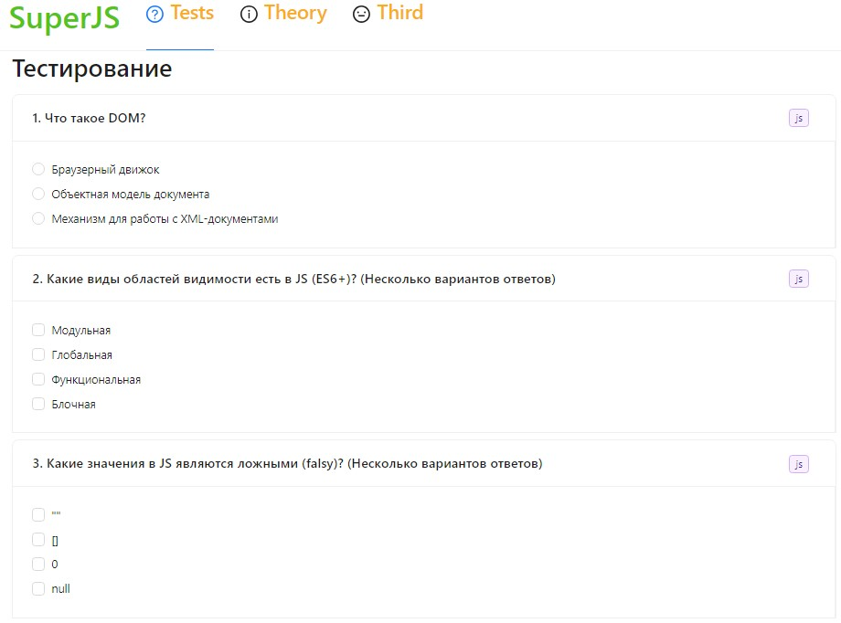

- На какие то вопросы один ответ, на какие-то - несколько.
  Есть также вопросы с кодом:

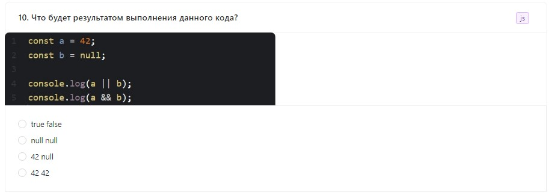

На данный момент присутствуют вопросы только по направлению JavaScript и HTML. В дальнейшем планируется добавить вопросы о CSS и TypeScript, а так же настройку тем в начале тестирования.

------

#### Ответы

- После прохождения тестирования выводится результат.

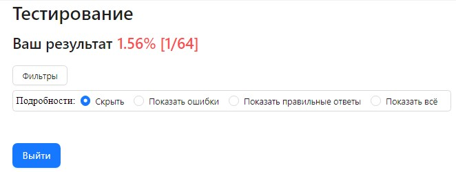

Можно настроить вывод подробных результатов тестирования, выбрав один из пунктов в списке "Подробности" .

- Описание вывода результатов и вариант с правильным ответом показаны ниже:

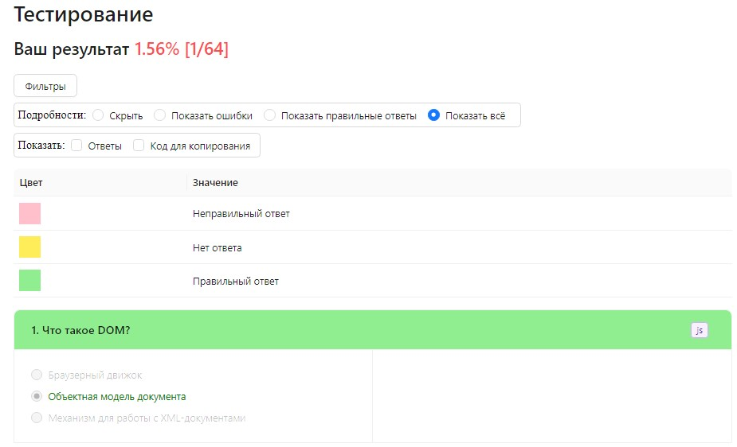

- Карточка без ответа:

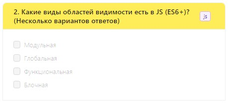

- Карточка с неправильным ответом:

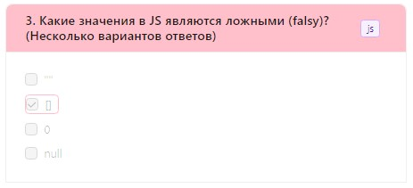

- После выбора вывода ответа в строке "Показать" будет указываться правильный ответ и пояснение:

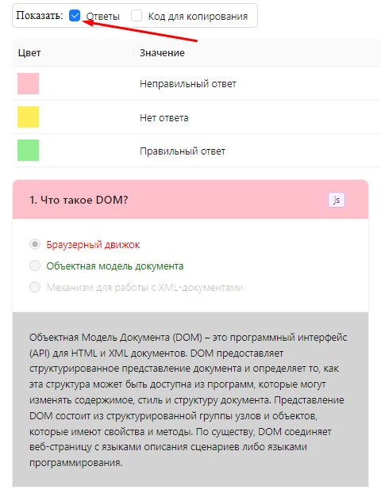

- Для вопросов с кодом также можно выбрать опцию вывода кода для копирования и самостоятельного изучения:

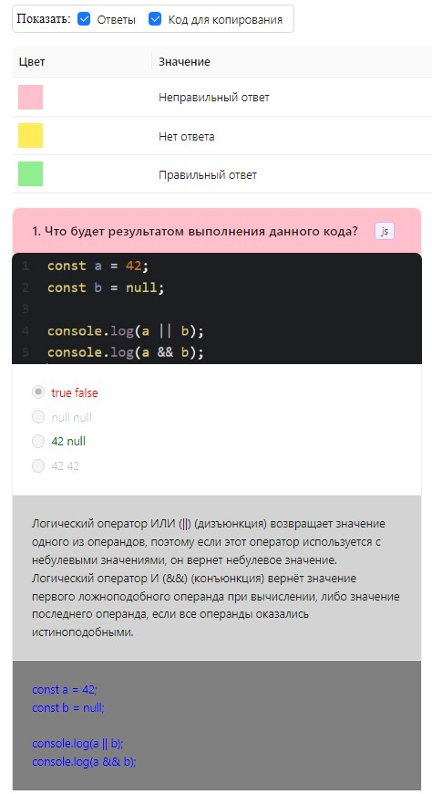

- Можно отсортировать ответы по нужным категориям:

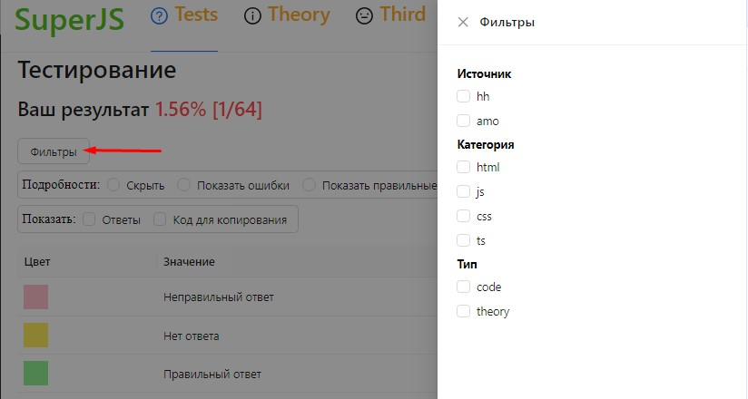

------

## Страница теории

На странице тестов представлены сравнения различных методов, коллекций в JS.

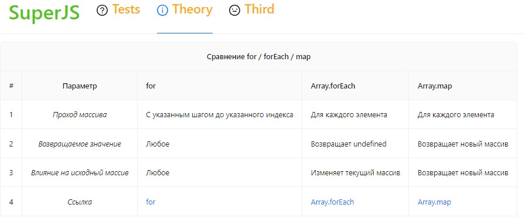

Кроме сравнения в таблицах указаны ссылки на [mdn](https://developer.mozilla.org/en-US/) для самостоятельного изучения / уточнения подробностей.

------

## Страница полезных ссылок, etc..

Третья страница предназначена для разнообразного контента - одним из которых являются ссылки на полезные ресурсы, предоставляющие удобные / интересные / забавные способы изучения всего необходимого для frontend-разработчика.

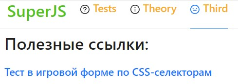